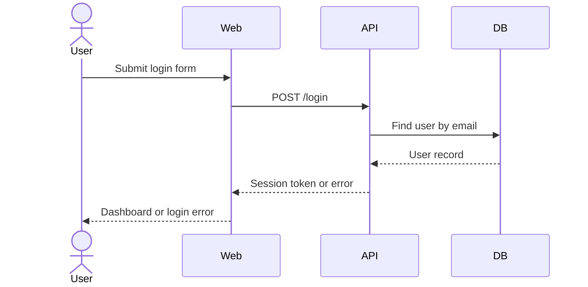

# Documentation Quality Bar

This file defines what "good enough" means for Harness artifacts.

## General Standard

A good document lets another human or agent continue the work without asking basic context questions.

Every artifact MUST be:

- Specific: names concrete behavior, modules, contracts, commands, and constraints.
- Traceable: links backward to source context and forward to design, verification, decisions, or release.
- Decision-useful: records the reasoning needed to choose or reject an approach.
- Verifiable: includes acceptance criteria, test plan, evidence, or a reason verification is not needed.
- Scoped: states what is in scope and what is out of scope.
- Current: reflects the implementation after reconciliation, not only the original intention.

Every artifact MUST avoid:

- Vague goals like "improve UX" without acceptance criteria.
- Hidden assumptions.
- Long historical summaries that belong in linked docs.
- Claiming tests passed without command evidence.
- Copying large code or logs instead of summarizing the relevant result.

## Good Ticket

A good ticket answers:

- What user, system, or maintainer problem is being solved?
- What outcome counts as success?
- What is explicitly out of scope?
- What areas may be impacted?
- Is it small enough to auto-run, or does it need detail design approval?
- What tests or UAT must prove it works?
- What docs may need reconciliation?

Minimum quality checklist:

- [ ] ID and status use the shared status model.
- [ ] Requirement and phase links are present or explicitly not applicable.
- [ ] Acceptance criteria are observable and testable.
- [ ] Scope is narrow enough for one agent session or one implementation slice.
- [ ] Small-task exemption is filled when approval is skipped.
- [ ] Impacted areas include code, requirements, architecture, API, ERD/data, decisions.
- [ ] Completion checklist includes tests, UAT, docs review, context update, and trace links.

Bad:

```text
Add login.
```

Good:

```text
Allow existing users to sign in with email and password so they can access the dashboard.
Acceptance:
- Valid credentials create a session and redirect to `/dashboard`.
- Invalid credentials show a non-enumerating error.
- Session survives refresh.
- Auth API, security notes, and UAT are reconciled.
```

## Good Detail Design

A good detail design proves the agent understands the change before implementation.

It MUST answer:

- Why is this change needed?
- What exact approach will be implemented?
- Which modules/files/contracts are touched?
- What alternatives were considered and rejected?
- What can break?
- How will correctness be verified?
- Which master docs may change?
- Does this create a durable decision requiring an ADR?

Minimum quality checklist:

- [ ] Problem statement is concrete.
- [ ] Context loaded is listed.
- [ ] Brownfield touched scope is recorded when applicable.
- [ ] Proposed approach is implementation-ready but not over-specified.
- [ ] Alternatives include at least one realistic rejected option for non-trivial work.
- [ ] Impact covers code, behavior, API, data, security, runtime, and docs.
- [ ] Test plan includes command-level verification or explains why not.
- [ ] Reconciliation plan says update/no-change for requirements, architecture, API, ERD, ADR, context.
- [ ] Approval status is explicit.

For bug work, the design MUST also include:

- Reproduction
- Root cause
- Impact scope
- Fix strategy
- Regression risk
- Regression test plan

## Good Bug Report

A good bug report separates symptom from cause.

Minimum quality checklist:

- [ ] Reproduction steps are precise enough for another agent to run.
- [ ] Expected and actual behavior are separate.
- [ ] Severity and priority are set.
- [ ] Root cause is filled after investigation, not guessed at intake.
- [ ] Impact scope includes users, data, contracts, and related modules.
- [ ] Regression tests prove the defect will not return.

## Good ADR

A good ADR records a decision that should survive the current chat.

Create an ADR for:

- API/schema/auth/deployment changes
- Major dependencies
- Module boundary or ownership changes
- Security model changes
- Workflow or standards changes
- Significant tradeoffs with future consequences

Minimum quality checklist:

- [ ] Context explains why the decision exists now.
- [ ] Decision is a single clear choice.
- [ ] Alternatives are realistic.
- [ ] Consequences include positive and negative tradeoffs.
- [ ] Linked work and master docs are listed.

## Diagram Guide

Use diagrams only when they reduce ambiguity. Do not add diagrams as decoration.

| Diagram | Required Format | Use When | Must Show | Avoid |
| --- | --- | --- | --- | --- |
| Context diagram | ASCII diagram | Explaining system boundary or external actors | System, users, external systems, trust boundaries | Internal implementation detail |
| Architecture overview | ASCII diagram | Explaining high-level system structure | Main layers/modules/services and direction of dependency | Every class/file |
| Component interaction | ASCII diagram | Explaining how components collaborate statically | Components, responsibilities, ownership, dependencies | Request timing or call order |
| Sequence diagram | Mermaid `sequenceDiagram` | Explaining request flow, event flow, async flow, or bug reproduction | Actors, ordered messages, success/failure paths | Static structure |
| Data flow diagram | ASCII diagram or Mermaid flowchart | Explaining how data moves or transforms | Sources, sinks, transformations, sensitive data | UI click flow |
| ERD | Mermaid `erDiagram` or table format | Explaining persistent data model | Entities, relationships, keys, constraints | Runtime call order |
| State diagram | Mermaid `stateDiagram-v2` | Explaining lifecycle/status transitions | States, transitions, guards | Linear procedures |
| Flowchart | Mermaid `flowchart` | Explaining branching process or workflow | Decisions, branches, terminal states | Deep architecture |
| Deployment diagram | ASCII diagram | Explaining runtime environments | Services, infrastructure, network boundaries, external dependencies | Business requirements |

Format rules:

- Architecture, context, deployment, and component interaction diagrams MUST use ASCII diagrams in fenced `text` blocks.
- Sequence diagrams MUST use Mermaid `sequenceDiagram`.
- ERDs SHOULD use Mermaid `erDiagram` when relationships matter; use tables when the model is small or still unstable.
- State diagrams MUST use Mermaid `stateDiagram-v2`.
- Flowcharts SHOULD use Mermaid `flowchart`.
- Data flow diagrams MAY use ASCII or Mermaid flowchart, depending on which is clearer.

ASCII architecture/component example:

```text
+-------------+        +-------------+        +-------------+
| Web Client  | -----> | API Server  | -----> | Database    |
+-------------+        +-------------+        +-------------+
       |                      |
       v                      v
+-------------+        +-------------+
| Auth Store  |        | Event Bus   |
+-------------+        +-------------+
```

Mermaid sequence example:



Diagram quality checklist:

- [ ] Diagram has a title and purpose.
- [ ] Scope is clear.
- [ ] Nodes and edges are labeled.
- [ ] It links to the ticket, design, ADR, or master doc it supports.
- [ ] It is updated or removed during reconciliation if the implementation diverges.

Preferred markdown formats:

- Mermaid for sequence diagrams, flowcharts, state diagrams, and ERD-style sketches.
- Text tables for small interface or dependency maps.
- External diagrams only when the source file or link is stored in the relevant doc.

## Good Master Doc Update

Master docs should be concise and durable.

Update master docs with:

- Stable behavior
- Public contracts
- Architecture boundaries
- Data ownership
- Decisions and links to ADRs
- Known constraints and operational facts

Do not put these in master docs:

- Temporary implementation notes
- Raw terminal output
- Long investigation logs
- Unapproved design ideas
- Details only relevant to one completed ticket

Those belong in tickets, bugs, detail designs, test verification, or release notes.
