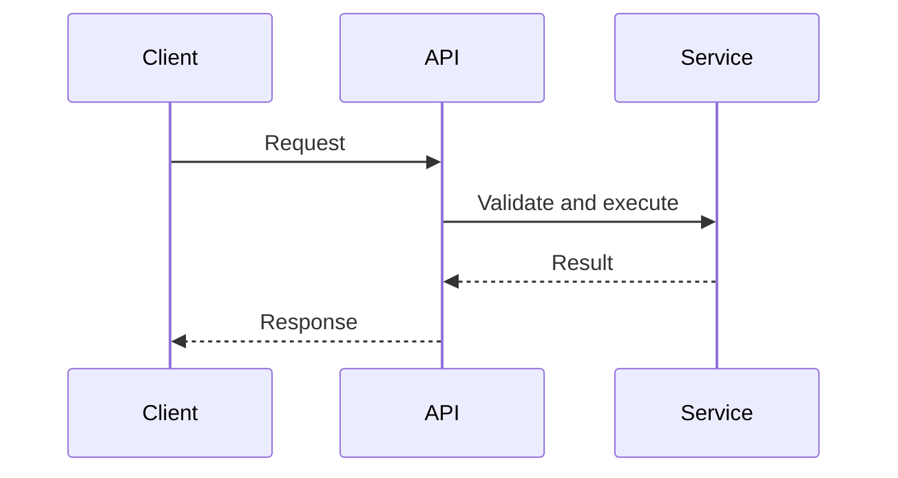

# API Template

Before filling this template, read `docs/standards/QUALITY_BAR.md#good-master-doc-update`.

## Copy And Fill Rules

- Human owns public contract intent and approval.
- AI documents request/response, errors, auth, sequence flow, and versioning from implementation or approved design.
- Public contract changes require docs review and may require ADR.
- Use Mermaid `sequenceDiagram` for request/event flow.

## Field Ownership

- Human owns business contract intent and approval for public contract changes.
- AI fills request/response details, errors, auth notes, sequence diagram, and versioning notes from implementation.

## Status

- ID: API-000
- Status: draft | ready | in_progress | blocked | in_review | verified | done
- Owner: TBD

## Trace Links

- Requirements: TBD
- Phases: TBD
- Tickets/Bugs: TBD
- Detail designs: TBD
- Test verification: TBD
- Docs review: TBD
- ADRs: TBD
- Release notes: TBD

## Contract

- Name: TBD
- Type: HTTP | RPC | event | CLI | other

## Sequence Diagram

Use Mermaid `sequenceDiagram` for request/event flow.

## Authentication

TBD

## Request

TBD

## Response

TBD

## Errors

| Error | Meaning | Consumer Impact |
| --- | --- | --- |
| TBD | TBD | TBD |

## Versioning

TBD

## Linked Decisions

- TBD
