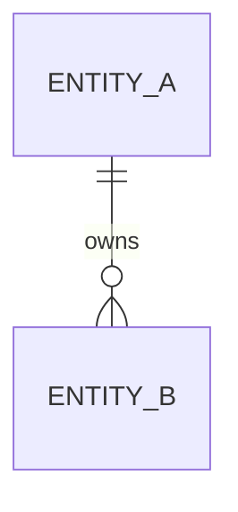

# ERD Template

Before filling this template, read `docs/standards/QUALITY_BAR.md#diagram-guide` and `docs/standards/QUALITY_BAR.md#good-master-doc-update`.

## Copy And Fill Rules

- Human owns data ownership and migration approval.
- AI documents entities, relationships, constraints, and migration notes from accepted design or implementation.
- Use Mermaid `erDiagram` when relationships matter.
- Data ownership, deletion, retention, or migration decisions may require ADR.

## Field Ownership

- Human owns data ownership and migration approval decisions.
- AI fills entities, relationships, constraints, migration notes, and ERD diagram from implementation evidence.

## Status

- ID: ERD-000
- Status: draft | ready | in_progress | blocked | in_review | verified | done
- Owner: TBD

## Trace Links

- Requirements: TBD
- Phases: TBD
- Tickets/Bugs: TBD
- Detail designs: TBD
- Test verification: TBD
- Docs review: TBD
- ADRs: TBD
- Release notes: TBD

## Entities

| Entity/Table | Purpose | Owner | Notes |
| --- | --- | --- | --- |
| TBD | TBD | TBD | TBD |

## ERD Diagram

Use Mermaid `erDiagram` when relationships matter.

## Relationships

| From | To | Relationship | Notes |
| --- | --- | --- | --- |
| TBD | TBD | TBD | TBD |

## Constraints

- TBD

## Migrations

- TBD

## Linked Decisions

- TBD
